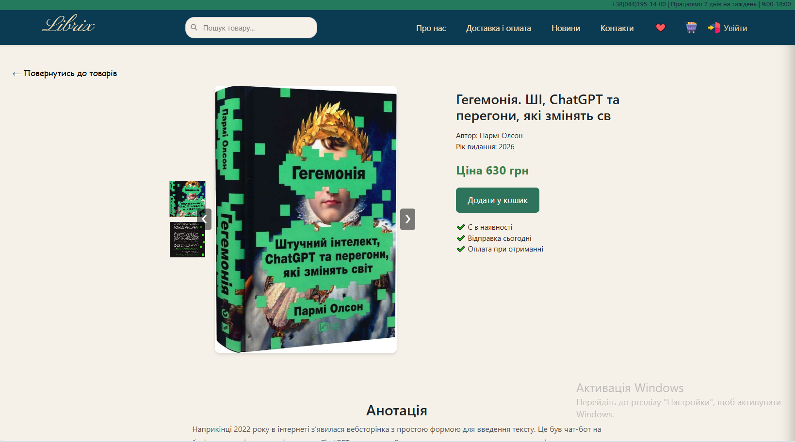
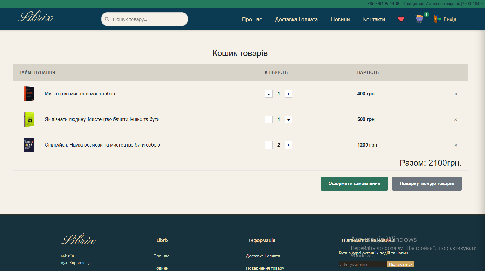
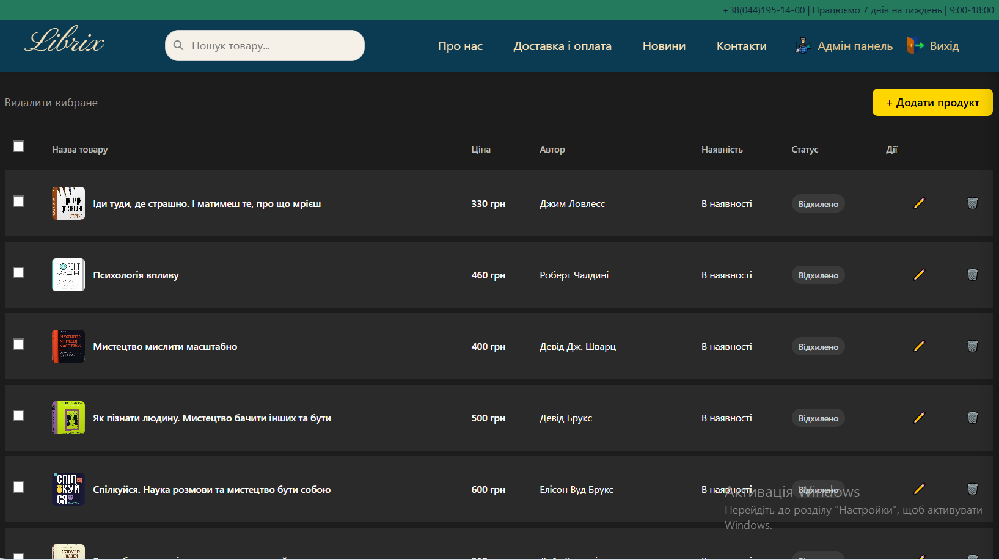

# Bookstore 

A full-stack online bookstore built with React and Node.js.

This is a personal project created to practice working with React, GraphQL, Node.js, PostgreSQL and user authentication.

The application has a product catalog, search, pagination, favorites, shopping cart and a separate admin section for managing products.

## Demo

**Frontend:** https://bookstore-ten-phi.vercel.app

**Backend:** https://bookstore-server-yxvj.onrender.com

**GitHub:** https://github.com/AnastasiaPletser/Bookstore

## Features

* User registration and login
* JWT authentication
* User roles: `USER` and `ADMIN`
* Product catalog
* Product search
* Pagination
* Product details
* Favorites
* Shopping cart
* Product quantity management
* Admin panel
* Add, edit and delete products
* Responsive design

## Tech Stack

### Frontend

* React
* React Router
* React Context
* Apollo Client
* GraphQL
* Axios
* Bootstrap
* React-Bootstrap
* SCSS
* CSS Modules

### Backend

* Node.js
* Express
* GraphQL
* Apollo Server
* Sequelize
* PostgreSQL
* JWT
* bcrypt

### Tools

* Git
* GitHub
* Vercel
* Render

## Project Structure

```text
Bookstore/
├── client/
│   ├── src/
│   │   ├── components/
│   │   ├── pages/
│   │   ├── graphql/
│   │   ├── store/
│   │   ├── context/
│   │   ├── http/
│   │   └── apollo/
│   └── package.json
│
├── server/
│   ├── controllers/
│   ├── graphql/
│   ├── models/
│   ├── middleware/
│   ├── uploads/
│   ├── db.js
│   └── index.js
│
└── README.md
```

## Application Structure

The frontend is built with React and communicates with the backend using GraphQL.

The backend is built with Node.js and Express. Sequelize is used to work with the PostgreSQL database.

```text
React
  ↓
Apollo Client
  ↓
GraphQL API
  ↓
Node.js / Express
  ↓
Sequelize
  ↓
PostgreSQL
```

JWT is used for authentication. The application also checks the user's role to restrict access to admin functionality.

## Admin Panel

Users with the `ADMIN` role can access the admin section.

The admin panel allows users to:

* add products
* edit products
* delete products
* manage product information

## Product Images

For the current version of the project, product images are loaded using external image URLs.

The database used for this project is temporary, so I chose not to add a separate image storage service at this stage.

For a production version, the images could be moved to a dedicated storage service such as Cloudinary or Amazon S3.

## Environment Variables

The project uses environment variables for local and production configuration.

### Client

Create `client/.env`:

```env
REACT_APP_API_URL=http://localhost:5001/
```

For the deployed version, this variable should contain the URL of the deployed backend.

### Server

Create `server/.env` with the required PostgreSQL and JWT configuration.

Environment files are not included in the repository.

## Run Locally

Clone the repository:

```bash
git clone https://github.com/AnastasiaPletser/Bookstore.git
cd Bookstore
```

Install client dependencies:

```bash
cd client
npm install
```

Install server dependencies:

```bash
cd ../server
npm install
```

Start the server:

```bash
npm run dev
```

Start the client in another terminal:

```bash
cd client
npm start
```

The frontend will be available at:

```text
http://localhost:3000
```

The GraphQL API will be available at:

```text
http://localhost:5001/graphql
```

## Deployment

The application is deployed as separate frontend and backend services.

* Frontend — Vercel
* Backend — Render
* PostgreSQL — Render

## Screenshots

### Home Page


### Product Details



### Shopping Cart



### Admin Panel



## What I Worked On

I built the application as a full-stack project and worked on both the frontend and backend.

The main parts of the project include:

* React components and pages
* state management with Context API
* GraphQL queries and mutations
* JWT authentication
* user roles and protected routes
* CRUD operations for products
* PostgreSQL database
* responsive styling
* frontend and backend deployment
* environment configuration

## Author

**Anastasiia Pletser**

Junior Front-End Developer

GitHub:
https://github.com/AnastasiaPletser
